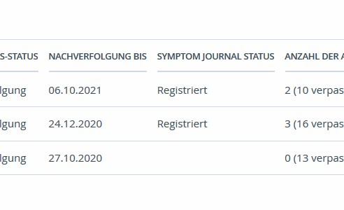
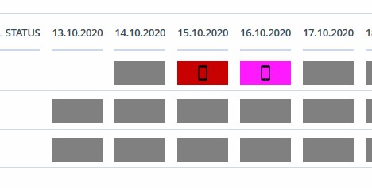
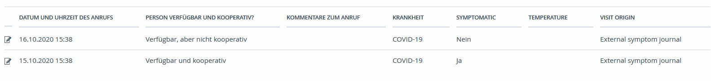

# SORMAS REST API for external symptom journals

This guide explains:
 * why this API is needed
 * how to access the API
 * the data structures involved
 * the endpoints and their purpose, together with explanations of their parameters, response types and examples.
 * how registering a SORMAS person as an external journal patient could work
 * some usage notes and how the data is used in SORMAS
 
### Motivation
SORMAS provides the possibility to register contacts for confirmed cases. For some diseases (e.g. COVID19)
these contacts are contacted on a daily basis, to check their symptoms, temperature etc.<br/> SORMAS currently 
has to some extent this functionality: each contact has a follow-up period, during which we can register
visits, containing the status and symptoms of the person.<br/>
There exist other applications built specifically for this purpose, which have additional features, 
automatically sending symptom questionnaires to contacts etc. It is desirable to integrate these other systems
with SORMAS, to enable better tracking and collecting more accurate data.
The purpose of this API is to enable communication between SORMAS and other symptom journals. 

### How to access the API
Only users with the role ``REST_EXTERNAL_VISITS_USER`` are authorized to use the endpoints. If you would like to 
receive access, please contact the team to have a user set up. <br/>
The API is available as a REST resource (depending on the environment you are trying to access) at:
``<<domain>>/sormas-rest/visits-external/``<br/>
Authentication is done using basic auth, with the user and password.
Data in request and response bodies will be in JSON format unless stated otherwise below. <br/>
**Note:** SORMAS also uses Swagger to document its REST API. However, in order to generate the OpenAPI specification,
you need to build the project. More information can be found [here](sormas-rest/README.md).

### Data structures
The following are the data structures accepted and returned by the API. Mandatory fields are marked with an asterisk (*).

##### ``JournalPersonDto``
* A selection of personal data, including first and last name, e-mail, phone number(s) and birth date if available
* Fields without a value may not be returned
* The ``pseudonymized`` field shows whether the sensitive data has been replaced with pseudonyms i.e. artificial identifiers
* The ``latestFollowUpEndDate`` field returns the latest follow-up end date as UNIX time * 1000 (milliseconds since the UNIX epoch). 
```
{
    "uuid": string,
    "pseudonymized": boolean,
    "firstName": string,
    "lastName": string,
    "emailAddress": string,
    "phone": string,
    "birthdateDD": number,
    "birthdateMM": number,
    "birthdateYYYY": number,
    "sex": Sex,
    "latestFollowUpEndDate": number
}
```
##### ``Sex``
* ``enum`` with values ``MALE``, ``FEMALE``, ``OTHER``, ``UNKNOWN``
##### ``PersonSymptomJournalStatusDto``
* contains the status of the person as well as the timestamp
* the timestamp format is ``yyyy-MM-dd'T'HH:mm:ss.SSSZ``
```
{
    "status": SymptomJournalStatus,
    "statusDateTime": string
}
```
##### ``SymptomJournalStatus``
* ``enum`` with values ``UNREGISTERED``, ``REGISTERED``, ``ACCEPTED``, ``REJECTED``, ``DELETED``
##### ``ExternalVisitDto``
* contains details such as symptoms, status etc. for a single visit
* the timestamp format is ``yyyy-MM-dd'T'HH:mm:ss.SSSZ``
```
{
    "personUuid": string*,
    "disease": Disease*,
    "visitDateTime": string*,
    "visitStatus": VisitStatus*,
    "visitRemarks": string
    "symptoms" : SymptomsDto,
    "reportLat": 0,
    "reportLon": 0,
    "reportLatLonAccuracy": 0
}
```
##### ``Disease``
* ``enum`` with multiple diseases supported by SORMAS. The most common diseases which will be processed by external symptom 
journals is ``CORONAVIRUS``. 
##### ``VisitStatus``
* ``enum`` with values ``UNAVAILABLE``, ``UNCOOPERATIVE``, ``COOPERATIVE``
##### ``SymptomsDto``
* contains various symptoms related to the diseases supported by SORMAS
* the following data structure contains only the symptoms/data relevant to COVID19:
```
{
    "abdominalPain": SymptomState,
    "chestPain": SymptomState,
    "chillsSweats": SymptomState,
    "cough": SymptomState,
    "coughWithSputum": SymptomState,
    "coughWithHeamoptysis": SymptomState,
    "diarrhea": SymptomState,
    "difficultyBreathing": SymptomState,
    "fatigueWeakness": SymptomState,
    "fever": SymptomState,
    "headache": SymptomState,
    "heartRate": number,
    "height": number,
    "jointPain": SymptomState,
    "lymphadenopathy": SymptomState,
    "musclePain": SymptomState,
    "nausea": SymptomState,
    "otherNonHemorrhagicSymptoms": SymptomState,
    "otherNonHemorrhagicSymptomsText": string, 
    "runnyNose": SymptomState,
    "skinRash": SymptomState,
    "soreThroat": SymptomState,
    "symptomatic": boolean,
    "symptomsComments": string,
    "temperature": number,
    "temperatureSource": TemperatureSource,
    "unexplainedBleeding": SymptomState, 
    "vomiting": SymptomState,
    "coma": SymptomState,
    "fluidInLungCavityAuscultation": SymptomState,
    "fluidInLungCavityXray": SymptomState, 
    "abnormalLungXrayFindings": SymptomState,
    "conjunctivalInjection": SymptomState,
    "acuteRespiratoryDistressSyndrome": SymptomState,
    "pneumoniaClinicalOrRadiologic": SymptomState, 
    "lossOfTaste": SymptomState,
    "lossOfSmell": SymptomState,
    "wheezing": SymptomState,
    "skinUlcers": SymptomState,
    "inabilityToWalk": SymptomState,
    "inDrawingOfChestWall": SymptomState,
    "respiratoryDiseaseVentilation": SymptomState,
    "feelingIll": SymptomState,
    "fastHeartRate": SymptomState,
    "oxygenSaturationLower94": SymptomState,
    "weight": number,
    "confusedDisoriented": SymptomState,
    "otherComplications": SymptomState,
    "otherComplicationsText": string,
    "seizures": SymptomState,
    "shivering": SymptomState,
    (Switzerland only) "feverishFeeling": SymptomState,
    (Switzerland only) "weakness": SymptomState,
    (Switzerland only) "fatigue": SymptomState,
    (Switzerland only) "coughWithoutSputum": SymptomState,
    (Switzerland only) "breathlessness": SymptomState,
    (Switzerland only) "chestPressure": SymptomState,
    (Switzerland only) "blueLips": SymptomState,
    (Switzerland only) "bloodCirculationProblems": SymptomState,
    (Switzerland only) "palpitations": SymptomState,
    (Switzerland only) "dizzinessStandingUp": SymptomState,
    (Switzerland only) "highOrLowBloodPressure": SymptomState,
    (Switzerland only) "urinaryRetention": SymptomState 
}
```
##### ``SymptomState``
* ``enum`` with values ``YES``, ``NO``, ``UNKNOWN``
##### ``TemperatureSource``
* ``enum`` with values ``AXILLARY``, ``ORAL``, ``RECTAL``, ``NON_CONTACT``
##### ``PushResult``
* ``enum`` with values ``OK``, ``TOO_OLD``, ``ERROR``
##### ``PersonFollowUpEndDto``
* represents the latest follow-up end date for a person
* The ``latestFollowUpEndDate`` field returns the latest follow-up end date as UNIX time * 1000 (milliseconds since the UNIX epoch).
```
{
    "personUuid": string,   
    "latestFollowUpEndDate": number
}
```

### Endpoints
##### GET ``/version``
* Get the API version. This is the minimal version needed for compatibility with the API."
* returns a ``string`` representing the API version
* example response body: ``"1.37.0"``
##### GET ``/person/{personUuid}``
* Get person information. Note that ``null`` value fields may not be returned in the response body. 
* ``personUuid`` - path parameter representing the ID of the person to retrieve.
* If you get an unexpected result, it might help to verify whether a person with the given ``personUuid`` exists in SORMAS 
by using the ``isValid`` endpoint.
* returns a ``JournalPersonDto`` object
* example responses:
```
{
    "uuid": "SMTVIR-JGCPDI-RILC5G-D7SMSG3Z",
    "pseudonymized": false,
    "firstName": "Anna",
    "lastName": "Franken",
    "emailAddress": "anna@gmail.com",
    "birthdateDD": 6,
    "birthdateMM": 7,
    "birthdateYYYY": 1981,
    "latestFollowUpEndDate": 1603317600000
}
``` 
```
{
    "uuid": "SJRFIF-EAF2JS-VNCLI5-TSR5CDQZ",
    "pseudonymized": false,
    "firstName": "Alexander",
    "lastName": "Weiss",
    "phone": "004915152726157",
    "birthdateDD": 12,
    "birthdateMM": 2,
    "birthdateYYYY": 1990,
    "sex": "MALE",
    "latestFollowUpEndDate": 1603317600000
}
```
##### GET ``/person/{personUuid}/isValid``
* Check if a person with the given ``personUuid`` exists in SORMAS.
* returns ``true`` or ``false``
##### GET ``/followUpEndDates/{since}``
* Get the latest follow-up end date assigned to each person registered in the symptom journal.
Note: Only returns values for persons who have their symptom journal status set to ``ACCEPTED``.
* ``since`` - path parameter given as UNIX time * 1000 (milliseconds since the UNIX epoch). 
Only value modified after this point in time will be returned.
* returns a list of ``PersonFollowUpEndDto`` objects.
* example response: 
```
[ 
    {
        "personUuid": "Q56VFD-G3TXKT-R2DBIW-FTWIKAMI",
        "latestFollowUpEndDate": 1599602400000
    },
    {
        "personUuid": "TEYCIW-BHWHMH-MH2QIW-KBP72JMU",
        "latestFollowUpEndDate": 1593727200000
    }
]
```
##### POST ``/``
* Upload visits with all symptom and disease related data to SORMAS.
* the request body is a list of ``ExternalVisitDto`` objects
* the response is a list of ``PushResult`` objects, each corresponding to a visit.
* example request body:
```
[
    {
        "personUuid": "WAL77W-IGOBNT-37FMBQ-FHSK2C4U",
        "disease": "CORONAVIRUS",
        "visitDateTime": "2020-10-15T12:38:16.026Z",
        "visitStatus": "COOPERATIVE",
        "symptoms" : {
            "cough": "YES",
            "temperature": 37.6,
            "temperatureSource": "AXILLARY"
        },
        "reportLat": 0,
        "reportLon": 0,
        "reportLatLonAccuracy": 0
    },
    {
        "personUuid": "WAL77W-IGOBNT-37FMBQ-FHSK2C4U",
        "disease": "CORONAVIRUS",
        "visitDateTime": "2020-10-16T12:38:16.026Z",
        "visitStatus": "UNCOOPERATIVE",
        "reportLat": 0,
        "reportLon": 0,
        "reportLatLonAccuracy": 0
    }
]
```
* example response:
```
[
    "OK",
    "ERROR"
]
```

##### POST ``/person/{personUuid}/status``
* Save the symptom journal status for a person
* ``personUuid`` - path parameter representing the ID of the person whose status will be saved.
* If you get an unexpected result, it might help to verify whether a person with the given ``personUuid`` exists in SORMAS 
by using the the ``isValid`` endpoint.
* the request body is a ```PersonSymptomJournalStatusDto``` object
* returns ``true`` if the status was set successfully, ``false`` otherwise.
* example request body:
```
{
    "status": "REGISTERED",
    "statusDateTime":"2020-04-15T12:55:00.000+02:00"
}
```

### Registering a SORMAS person in an external journal
* a protocol for retrieving person data from SORMAS and registering a corresponding patient in an external
symptom journal is decided on a case by case basis.
* there exists the possibility that SORMAS send the ``personUuid`` to the external journal, which then fetches 
the person data using the ``/person`` endpoint.
* another option is that the external journal provides an endpoint to which SORMAS cand directly send person data.
* this protocol should be agreed with the SORMAS team, as well as how data is kept synchronised between the systems,
constraints on person information etc.
* access details for each external symptom journal (such as credentials, API endpoints) are needed and will be
saved in ``sormas.properties``.

### Usage notes
* use the ``isValid`` endpoint to check if a person exists in SORMAS
* after an attempted registration in the symptom journal, use the ``status`` endpoint to 
update the status of the person in SORMAS accordingly. Check the available status values
and contact the team members if assistance is needed for the mapping. <br/>
The status is visible in SORMAS in the contact directory: <br/>

* saving visits through the endpoint described above will register them as external visits in SORMAS.
These are visibile in the Contacts directory, in the visits tab, and are marked with a 
mobile phone icon: <br/>

* External visits are also visible in the contact details, in the visits tab: <br/>
