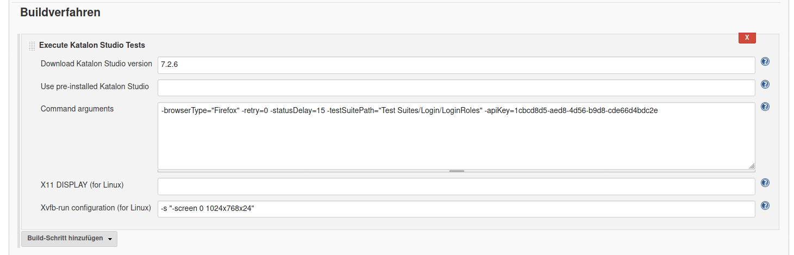
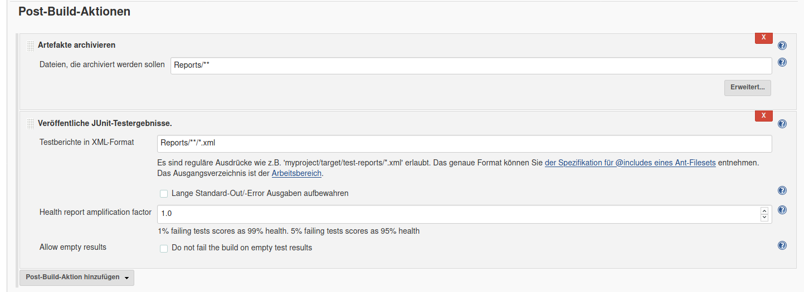

# Sormas Testing Suite

# Integration into Jenkins CI/CD

The integration of Katalon Studio in Jenkins is quite simple:

## Prequisites

System / OS packages needed to be installed:

- xvfb 
- firefox(-esr)

Jenkins plugins needed to be installed:

- katalon
- github
- git

## Jenkins configuration (FreeStyle element / mandatory)

### GitHub config

Repository URL: URL to Katalon Sormas tests

### Build config

Download Katalon Studio Version: `e.g.: 7.2.6`

Command arguments: `-browserType="Firefox" -retry=0 -statusDelay=15 -testSuitePath="Test Suites/Login/LoginRoles" -apiKey=<your api key>`

Xvfb-run configuration (for Linux): `-s "-screen 0 1024x768x24"`

### Post build config

Archive: `Reports/**`

JUnit-Tests: `Reports/**/*.xml`

## Getting the API-Key from Katalon Studio

In Katalon-Studio open the dialog Window->Command Palette

Select the option "Generate Command for Console Mode"

Copy the String from the field "Katalon API Key" and insert it into the build step from jenkins. 

