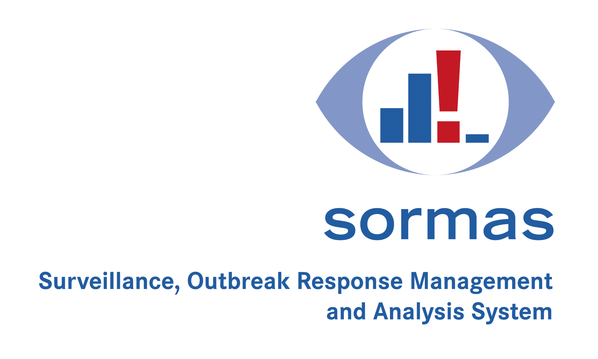

  
   
    

 

**SORMAS** (Surveillance Outbreak Response Management and Analysis System) is an open source eHealth system - consisting of separate web and mobile apps - that is geared towards optimizing the processes used in monitoring the spread of infectious diseases and responding to outbreak situations.

#### How Does it Work?
You can give SORMAS a try on our play server at https://sormas.helmholtz-hzi.de!

#### How Can I Get Involved?
Have a look at our [*Contributing Readme*](CONTRIBUTING.md) and contact us at sormas@helmholtz-hzi.de to learn how you can help to drive the development of SORMAS forward. SORMAS is a community-driven project, and we'd love to have you on board!

#### How Can I Report a Bug or Request a Feature?
Please [create a new issue](https://github.com/hzi-braunschweig/SORMAS-Project/issues/new/choose) and read the [*Submitting an Issue*](CONTRIBUTING.md#submitting-an-issue) guide for more detailed instructions. We appreciate your help!

#### Which Browsers and Android Versions Are Supported?
SORMAS officially supports and is tested on **Chromium-based browsers** (like Google Chrome) and **Mozilla Firefox**, and all Android versions starting from **Android 7.0** (Nougat). In principle, SORMAS should be usable with all web browsers that are supported by Vaadin 8 (Chrome, Firefox, Safari, Edge, Internet Explorer 11; see https://vaadin.com/faq).

## Project Structure
The project consists of the following modules:

- **sormas-api:** General business logic and definitions for data exchange between app and server
- **sormas-app:** The Android app
- **sormas-backend:** Server entity services, facades, etc.
- **sormas-base:** Base project that also contains build scripts
- **sormas-ear:** The ear needed to build the application
- **sormas-rest:** The REST interface; see [`sormas-rest/README.md`](sormas-rest/README.md)
- **sormas-ui:** The web application

## Server Management

* [Installing a SORMAS server](SERVER_SETUP.md)
* [Updating a SORMAS server](SERVER_UPDATE.md)
* [Customizing a SORMAS server](SERVER_CUSTOMIZATION.md)
