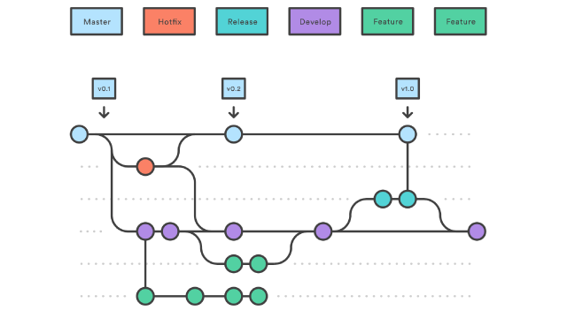

# Contributing Guidelines

If you want to contribute to SORMAS by any means - for example by submitting a bug report, requesting a new feature, translating the application into a new language, or actively contributing to the source code - please make sure to read through and follow these guidelines.
This allows us to consider and process your contribution as quickly and smoothly as possible. If there is anything unclear to you or you think that this guide is lacking coverage of a specific topic, please get in touch with us through our [GitHub Discussions](https://github.com/sormas-foundation/SORMAS-Project/discussions).

## Table of Contents

* [Submitting an Issue](#submitting-an-issue)
* [Security Issues](#security-issues)
* [Issue Types](#issue-types)
  * [Bug Report](#bug-report)
  * [Finding](#finding)
  * [Change Request](#change-request)
  * [Feature Request](#feature-request)
  * [Tasks](#task)
  * [Epic](#epic)
* [Contributing to the Project](#contributing-to-the-project)
* [Contributing to the Code](#contributing-to-the-code)
  * [Development Contributing Guidelines](#development-contributing-guidelines)
  * [Picking Issues for Development](#picking-issues-for-development)
  * [Submitting Pull Requests](#submitting-pull-requests)
* [Development Workflow](#development-workflow)
  * [Versioning](#versioning)
  * [Branches](#branches)
  * [Dependency Management](#dependency-management)

## Submitting an Issue

**Before creating a new issue, please search the repository for similar issues first to avoid duplicates!** You can do this by using the search field in the menu bar. If you find an issue that already covers your request or seems very similar, please comment on that issue.

We are currently distinguishing the following issue types: `bug`, `change`, `feature`, `finding`, `task` and `epic`.
Please make sure to always use one of the templates that are automatically presented to you when [creating a new issue](https://github.com/sormas-foundation/SORMAS-Project/issues/new/choose) because it ensures that your issue is structured and contains all the information that we need.
Issues that have not been created like this will be closed and you will be asked to submit a new issue that adheres to these guidelines.

Please add information to all mandatory sections of the issue templates, and try to fill in the optional sections if possible. Do not remove any section after submitting the issue because they might be filled later by the development team.
While moving forward in the development process, developers might also extend or alter the initial issue description, e.g. to adjust it according to the outcome of a refinement process.

## Security Issues

If you want to report a security issue, please follow our guidelines for [*Responsible Disclosure*](SECURITY.md).

## Issue Types

### Bug Report

Bug reports cover everything that leads to the application behaving in an unintended way, including crashes, unexpected error messages, data loss, etc.

Before creating a bug report, please check the following rules:

1. If something seems to be working correctly but does not necessarily match your expectations of how it should be working, please consider opening a change request instead. This applies also for performance issues.
2. If you have more than one possible bug, especially when you are tempted to create a list of independent findings in the **Bug Description**, please document each bug as separate issue.
3. Bugs should generally only be reported as new issues if they occur on a released version. If a bug only occurs on the current development version, it has very likely been caused by implementation done in the current iteration; in this case, the issue responsible for introducing the bug has to be reopened instead of creating a new issue.
This process helps to keep both the commit history and the release notes clean.

The development team defines a **severity** for bugs to distinguish the consequences for affected users:

* **critical:** The system is unusable as a whole or on critical functionality with no reasonable workaround available.
* **major:** A functional requirement is incorrect or incomplete and leads to errors or undesirable behavior.
* **minor:** Text issues or grammatical mistakes, layouting or cosmetic problems that do not affect the functionality.

### Change Request

Change requests cover features that are already part of SORMAS. This primarily includes aspects (or whole features) for which you would like to request an altered behavior, but also small extensions (e.g. additional values being added to a dropdown field).

A change request (excluding the optional fields) could look like this:

#### Problem Description
The "Test Results" card on the surveillance dashboard has a misleading caption. It suggests that it counts the results of all pathogen tests related to samples reported in the chosen time period while it actually refers to the final laboratory result of the latest sample associated to each case.

#### Proposed Change
Change the caption to "Final Laboratory Results" and add a tooltip that explains how the numbers are collected.

#### Added Value/Benefit
Users will have a better intuitive understanding of what the card shows, and misunderstandings are further prevented by adding the tooltip.

#### Acceptance Criteria
- [ ] The "Test Results" caption on the surveillance dashboard has been renamed to "Pathogen Test Results"
- [ ] An info icon has been added to the right of the caption; should look like the info icon in the case directory filters next to the case reference date dropdown
- [ ] Hovering over the icon displays the following tooltip: "When a case has multiple samples, only the final laboratory result of the sample with the latest sample collection date is considered."

### Feature Request

Feature requests cover everything that involves adding new features to SORMAS. This includes both very large additions like completely new app sections, but also smaller ones like adding a new field to an existing form.

### Finding

Findings are used to document unexpected behavior, mostly encountered during the development process. You can also use this issue type if you're not sure whether the behavior is a bug or not.

The development team will investigate the finding and add more details when needed. The goal is to either
- convert it to a bug if it is considered to be a bug on a released version.
- convert it to a change or feature request if there is something to improve.
- dismiss it as a `duplicate` if a responsible issue in the current iteration is found and reopened or fixed.
- dismiss it as `discarded` if the finding is not an issue.

A **severity** as for bugs can also be used for findings.

### Task

Tasks are things that need to be done but do not directly change anything about the product. This could for example be the preparation of an upcoming feature/change, optimization of processes on GitHub, working on automated tests, or the update of one of the guides or Wiki articles in this repository.

### Epic

The development team uses an epic as an umbrella for large change or feature streams that are linked together. Within the epic the included issues are linked in the **Tasks** section.

## Contributing to the Project

There are many ways in which you can contribute to this project as a non-developer. If there is something you would like to do that you don't find instructions about here - or if you want to learn how you can get involved - please contact us at info@sormas.org
or through our [GitHub Discussions](https://github.com/sormas-foundation/SORMAS-Project/discussions) and let us know how we can assist you!

Some possibilities to contribute to SORMAS are:

* [Helping with translation](I18N.md)
* [Defining new diseases](SOP_DISEASES.md)

## Contributing to the Code

If you're interested in participating in the development of SORMAS, please follow the [Development Environment Setup Instructions](DEVELOPMENT_ENVIRONMENT.md) before you start developing. If you have problems setting up your development environment or need assistance in choosing the first issue to work on,
please get in touch with us through our [GitHub Discussions](https://github.com/sormas-foundation/SORMAS-Project/discussions) or by contacting us at info@sormas.org.

Additionally, our [Wiki](https://github.com/sormas-foundation/SORMAS-Project/wiki) contains some specific development guides that cover common issues like adding new fields to an entity that we suggest to check out before you start implementing something related to those topics:

* [Technical User Guides](https://github.com/sormas-foundation/SORMAS-Project/wiki#technical-user-guides)
* [Development Guides](https://github.com/sormas-foundation/SORMAS-Project/wiki#development-guides)

### Development Contributing Guidelines

In addition to the guidelines covered by the Development Environment Setup Instructions, please ensure to adhere to the following principles and procedures while developing code for SORMAS.

#### Source Code

1. Remember to always apply code formatting and import reordering for all classes you work on; we recommend to use the Save Actions plugin as described in the setup instructions instead of manually executing these steps.
2. Some code formatting rules can't be enforced by the code formatter. Please make sure to write your code in accordance to the following rules:
    - When defining a method, enter a blank line before starting to write its body (except for methods with only one line of code, e.g. most getters and setters).
    - Use a blank line to separate logical blocks of code within a method.
    - Apart from those, don't use blank lines where they are not necessarily needed to keep the code compact and readable.
    - Don't use blank lines after the last statement of a block, but a closing `}` with proper indentation in the next line instead.
    - Don't use blank lines between two closing `}`.
3. You can use `//@formatter:off` and `//@formatter:on` to encapsulate code blocks that you don't want automatic code formatting to be applied to, e.g. because it would mess up readability. Please only use this if really needed and try to use proper indentation nonetheless.
4. Separate code and comments, i.e. write the comment in a separate line before the statement that you want to explain.
5. When you create new classes, please add license headers to them according to the [Adding License Headers guide](ADDING_LICENSE.md).

#### Commits

1. Commit messages of **every commit** have to be related to a specific issue on GitHub and reference its issue number as well as include a short description on what has been done in the commit. We will reject pull requests that violate this principle and ask you to re-submit it with proper commit messages. An acceptable commit message could look like this:
   > #1234 - Added model to define classification
2. A common practice for Git commits is to keep the first line with 50 characters as a meaningful short description, and to deliver additional details following in line 3 onwards. Most git viewers abbreviate the first line after 50 characters.
   > #1234 - Added model to define classification
   >
   > - Apply automatic case classification whenever a field value changes
   > - Show classification in lists
3. Keep changes in bugfixes clean and compact to be able to easily review them and leave the possibility to cherry-pick the changes to another branch to fix a previous version. Don't clean dirty code along the way if not really needed to fix the problem.
4. If an issue requires a lot of code changes, consider breaking down these changes in logical steps. They are then easier to review, have more meaningful commit messages and partly deliver the intended value.
5. Don't mix refactoring with functional changes (new functionality, changes on features, bugfixes) within the same commit, since it makes reviewing the changes much harder. Usually the refactoring of existing code has to happen beforehand in at least one separate commit. Refactoring includes e.g. cleaning up and restructuring code or renaming.
6. If it helps, it is okay to have several branches and pull requests for the same ticket (usually one after another, sometimes to work in parallel or to prepare changes in advance).
7. If there is a finding concerning an issue which has been already closed, it will be reopened if that version is not yet released. You (or someone else) will have to quickly fix the finding before the version is released. If the version has been released already, the issue will stay closed and a new issue has to be filed.

### Picking Issues for Development

When picking tasks for development, you can either search the repository for existing issues that you would like to work on, or you can submit your own issues if you don't find any that cover your topic of interest (see the "Submitting an Issue" section of this guide). However, please note that issues need to fit our overall vision of the project.

Once you have chosen an issue that you want to work on, **please adhere to the following process and ideally only start developing once it has been completed.** This ensures that your development work is perfectly aligned with the current state and vision of the project, and will make the pull request review process as smooth as possible.

1. Leave a comment on the issue about your intention to implement it.
2. A member of the core development team will check the issue and might:
    - Turn the issue into a discussion if they're not sure whether it fits the overall SORMAS vision or there are a lot of discussion points.
    - Ask for additional details to be added to the issue description if you have created the issue yourself and there are questions e.g. concerning its added value or the proposed solution.
    - Take the issue into internal refinement if it doesn't meet the [Definition of Ready](DEFINITION_OF_READY.md) yet.
3. If the issue meets the Definition of Ready, a member of the core development team adds the `ready` label and notifies you that you can start to implement it.

Issues that are already marked with the `ready` label can theoretically be picked up for development immediately. However, please note that these issues will usually already be planned for one of the upcoming iterations and it's possible that we'll start development on it ourselves. This is especially true for issues that are assigned to one of the sprint backlog projects.

### Submitting Pull Requests

Contributing to the SORMAS code requires you to submit pull requests that will be reviewed by one of our core developers. Once a pull request has been submitted to our repository, a developer will either assign themselves as its reviewer or we will get back to you in case we won't be able to review it in time.
This may e.g. happen if your pull request involves a lot of technical changes that we would like to merge together with other issues of the same nature or that could potentially break a lot of logic. Usually though, the general process looks like this:

1. A developer assigns themselves as the reviewer of your pull request (core developers assign each other). Please wait until the review is done; if you think that the review is taking too long, feel free to add a comment to the pull request as a reminder to the developer.
2. The developer might request changes to the code. If that's the case, please implement the requested changes or answer to their change request if you have questions or don't agree with a specific part of the request.
3. Once you've implemented all requested changes, please request another review by the assigned developer by clicking on the "Re-request review" icon next to their name. This step is necessary in order for the reviewer to be properly notified and for the pull request to show up in their review list again.
4. As soon as the developer is happy with the submitted code (which might require multiple iterations of step 2 and 3, especially for larger pull requests), they will merge it into the development branch and close the pull request.

Please adhere to the following principles when submitting pull requests:

1. Only submit pull requests that are directly associated with one specific issue in our GitHub repository. If there is no issue for the development work that you would like to do, create one before you start working on it.
2. Link your pull request to the issue(s) that they are associated with. This can be done either by using the "Linked issues" section at the right side when viewing a pull request, or by adding the keyword "Closes" or "Fixes" followed by the issue number to the pull request description (e.g. "Fixes #1234").
3. Make sure that your pull request has a meaningful title. By default, GitHub will use your commit message as the title which might not be appropriate. In general, using the same name as the linked issue is a good rule of thumb.
4. Try to not use force-push when updating an existing pull request (e.g. after changes have been requested or because you need to resolve merge conflicts).
5. Ideally, your pull request should pass the checks done by the automatic CI pipeline before it gets reviewed. If that's not the case, please make sure that your branch is up-to-date with the current development branch. If the checks also fail for the development branch, you're not required to do anything.
In any other case, please fix the issues (most likely failed unit tests) before requesting another review.

## Development Workflow

For SORMAS we use the **Gitflow** development workflow.

### Versioning

For version numbers we use semantic versioning. The meaning of a given version number `X.Y.Z` is:

* X: Major version: Major changes, severe changes in API or technical architecture.
* Y: Minor version: Usually a new release of a development iteration of a few weeks, containing new features and changes.
* Z: Micro version: Fixing problems in the last minor version to make it properly or better to use. Usually contains only bugfixes.

Versions are defined as [Git tags](https://github.com/sormas-foundation/SORMAS-Project/tags) with [release notes](https://github.com/sormas-foundation/SORMAS-Project/releases) attached to the tag.

An unstable version currently under development is denoted as `X.Y.Z-SNAPSHOT`.

### Branches

#### Permanent branches

* **development**: This is where the changes are commited/merged to by the developers.
* **master**: In regular intervals, the changes from `development` are merged to master with an identifiable version (tag). On top of this branch is always the latest released version.
* **master-<version>**: In case an older version than the head version on `master` needs to be fixed (a new micro release), a dedicated `master-<version>` branch is split from `master` to manage the following micro releases (Example: `master-1.75.x`). Changes made on this branch are usually cherry-picked from a newer version (on `master` or `development`).
* **l10n_development**: Incoming changes on translation files from Crowdin that are regularly merged into `development`.

#### Supporting branches

* **release-<version>**: To manage changes when merging from `development` to `master`. Once the new version is merged to `master`, the `release-<version>` branch is automatically removed.
* **hotfix-<version>**: To manage changes that are needed on an already released version (on any `master` branch) that need to be fixed with a new micro release.

Some branches contain the concerned version in its name, examples: `release-1.75.0`, `hotfix-1.75.1`. To manage new versions, tools are used to automatically merge between branches and tag the new version.
Once the new version is merged to `master`/`master-<version`, the `release-`/`hotfix-` branch are automatically deleted. There is only one `release-` and only `hotfix-` branch allowed at same time (enforced by the used Maven plugin).

#### Implementation branches

These kind of branches are manually created and maintained by developers who work on an issue. Such branches are used to create pull requests or to review the changes before merged into a permanent or supporting branch.
* **feature-1234_short_description**: Any branch that is supposed to contribute to `development` or a `hotfix` branch.

### Dependency Management

Dependencies are managed in Maven POM files. For most dependencies the version is defined in [sormas-base/pom.xml](sormas-base/pom.xml). \
[sormas-app](../sormas-app/app/build.gradle) and [sormas-e2e-tests](../sormas-e2e-tests/build.gradle) use Gradle instead.

#### Automatic updates

**Process**: At the beginning of each iteration, look over all [dependency update PRs](https://github.com/SORMAS-Foundation/SORMAS-Project/pulls?q=is%3Apr+is%3Aopen+label%3Adependencies) created by dependabot and process them according to the following rules:
1. Always use "Rebase and merge" instead of creating a merge commit! If needed use the comment `@dependabot rebase` to rebase the PR to the latest development commit.
2. If all CI checks are successful, minor and micro version updates can be merged
3. For major version updates read the changelog to understand implications and possible migration steps of the update. \
  Decide on you own wheter it is necessary to manually test the PR before merging.
4. If CI checks are negative or migration steps are needed, decide whether the update is important enough to justify the effort of additional work. \
If the PR is not needed, you can use `@dependabot ignore this major version` or `@dependabot ignore this minor version`.

#### Payara
All required dependencies provided by the Payara application server are set to "provided" in maven and may only be updated in combination with an update of the Payara version. \
These dependencies have been added to the dependabot ignore list, so no dependency update PR is automatically created.

#### Keycloak
The Keycloak version in SORMAS-Project only defines the version of the Keycloak admin client library. When a new version of Keycloak is available this should be updated after the [Keycloak version is SORMAS-Docker](https://github.com/SORMAS-Foundation/SORMAS-Docker/blob/devops/keycloak/Dockerfile) has been updated. \
This can be tested locally by building the updated Keycloak docker image and then using it in a  [container](https://github.com/SORMAS-Foundation/SORMAS-Project/tree/development/sormas-base/setup/keycloak) together with a local Payara instance.
