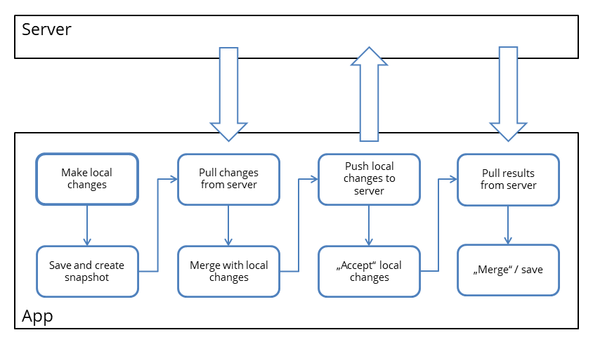

# Synchronization process between SORMAS App and Server

1. Make local changes

   The user changes some data with the SORMAS mobile app. E.g. the hospitalization of a case.

2. Save and create snapshot

   When saving local changes, the changed entity is marked as "modified". In addition a snapshot of the original data is created. This snapshot is later needed to compare local changes and server changes when merging.

3. Pull changes from server

   Get all data that was changed on the server since the last synchronization (e.g. pushed by another SORMAS app user).

4. Merge with local changes

   The changed data from the server is merged with local changes made by the app user. The snapshot that was created in step 2 is used as reference for the comparison.

   If the exact same field of an entity was modified on both server and app since the last synchronization, the server will "win". This means the local change is overridden and a log entry is added to the synchronization conflict log. The same goes for removed list items that were modified.

   The snapshot of changed entities is updated with the latestet server version

5. Push local changes to server

   After the merge is done the data of the app is "up to date". Now it is possible to send the local changes to the server. If pull and merge is not done before pushing, the server will reject all data that conflicts with changes made by other users.

6. "Accept" local changes

   After all local changes have been successfully pushed, we can "accept" them. This means the snapshot is deleted and the entity is no longer marked as modified.

7. Pull results from server

   Based on the data send the server same changes will have been made that need to be pulled. This will always include the change date based on the server time. In addition some entities may have been changed based on automatic processes (e.g. case classification).

8. "Merge" / save

   As in step 4 the pulled data from the server will be merged. Since there are no local changes, this means effectively that the data is just saved.
