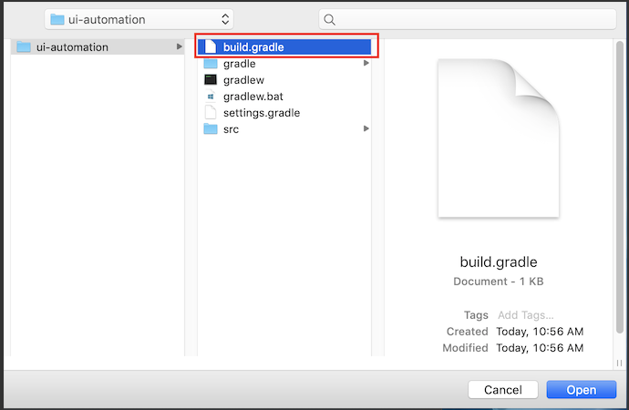

# Table of contents

* [General info](#general-info)
* [Technologies](#technologies)
* [Setup](#setup)
* [Test case design](#test-case-design)
* [Test execution](#test-execution)
* [Copyright](#copyright)
* [Guide to further resources](#guide-to-further-resources)

## General info

This automation project aims to help web developers to detect and prevent any
issues that might block successful web development.

## Technologies

* GUICE - sharing state between steps in Cucumber-JVM
* CUCUMBER - software tool used for acceptance tests written in a
  behavior-driven development style
* WebDriverManager  - webdriver provider
* LOMBOK - Java library helps to avoid repetitive code
* GRADLE - build automation tool
* JAVA FAKER  - project dependency generates random data for test scenarios
* Slf4j - Java logging framework
* ALLURE - test report tool

## Setup

* Clone the project and open only the *sormas-e2e-tests* subproject

* Install Java JDK 11 on your local machine

    ```text
    1. https://sdkman.io/install
    2. sdk install java 11.0.11-zulu
  OR
  Download the java zulu 11 from https://www.azul.com/downloads/zulu-community/?package=jdk
    ```

* Install Gradle
* Install Allure(To check this run `allure serve` from IntelliJ command line)
* Install IntelliJ IDEA please follow the steps [here](https://www.jetbrains.com/idea/)
* Launch IntelliJ IDEA and click on `Import project`

  

* As a new window is opened select `build.gradle`  in the project directory and
  click `Open`
  Alternatively go to IDea Preferences and search for `gradle`

  
  
* Open `Preferences` -> `Plugins` and install `Cucumber for Java` plugin

   
   
* Open `Preferences` -> `Compiler` and enable checkbox `Annotation processing`

  
  
* Open `Preferences` -> `Plugins` and install `Lombok` plugin

   
   
##Enable tests execution from local machine   

* Navigate to: resources/configuration/properties/common.properties
The default setup is set for remote execution:

```gherkin
BROWSER=chrome
REMOTE_DRIVER=true
HEADLESS=true 
LOG_RESTASSURED=false
```

* Change REMOTE_DRIVER value to false to run the tests from your local machine (optional HEADLESS to false to enable UI execution, and LOG_RESTASSURED to true to enable json logging)

* To change testing environment, open: resources/configuration/properties/environment/test-performance.properties
And update ENVIRONMENT_URL value (can be a local dev environments as well)
## Test case design

A design pattern is implemented based on a behavior-driven development style.
Cucumber creates specification called a feature file which consists of
multiple scenarios. Each scenario is a list of steps written in plain text, and
they must follow the syntax called Gherkin. Cucumber requires a set of step
definitions which map steps for the action should be performed. Feature files
can be taken as a base for living documentation and executable specification.

> Feature file example:

```gherkin
  Scenario: Create a new event
Given I log in with National User
And I click on the Events button from navbar
When I click on the NEW EVENT button
Then I create a new event
```

> Step definition file example:

```gherkin
    Given("I click on the Log In button",
() -> webDriverHelpers.clickOnWebElementBySelector(LoginPage.LOGIN_BUTTON));
```

## Test execution

Gradle is a management system tool for the project build and dependencies
configuration. Project contains `build.gradle` at a root level.
This file a build configuration script defines a project and its tasks.

> Execution from a terminal window example:

````gradle

gradlew clean startTests -Dcucumber.tags="@Login" -Denvironment=performance

````

## Reporting

* Allure is a test report tool provides a nice visual representation of executed
tests. Reporting requires [test execution](#test-execution) to generate some
test report data.
* Allure report is generated only from executions triggered via CLI.
* Open `allureReport` folder in a project and click on `index.html`. A new
generated report should be opened in the default browser.
* After running the tests you will be able to find the allure report in the root
of the project, in the allureReports folder.
The report works for UI and API tests as well, displaying steps, logs, failure reason and exit screenshots.
* You can add @issue=ticketNumber
to link GitHub bugs/tickets

> Allure test report example:


## Copyright

[Add the copyright](https://github.com/hzi-braunschweig/SORMAS-Project/blob/development/docs/ADDING_LICENSE.md)

## Guide to further resources

* [Cucumber Documentation](https://cucumber.io/docs/guides/)
* [WebDriverManager](https://bonigarcia.dev/webdrivermanager/)
* [Lombok](https://projectlombok.org/)
* [Gradle](https://gradle.org/)
* [Java faker](https://github.com/DiUS/java-faker)
* [Guice](http://www.thinkcode.se/blog/2017/08/16/sharing-state-between-steps-in-cucumberjvm-using-guice)
* [Allure](https://docs.qameta.io/allure/)
