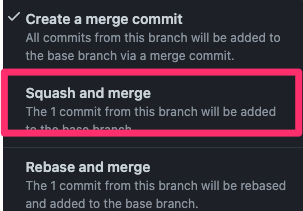

# QA automation Process

## 1. Create a branch from development

```text
1. git checkout development

2. git checkout -b #ticketNumber-Description
```

## 2. Implement the feature from the #ticket

```text
1. Create a feature file SORMAS-Project/sormas-e2e-tests/src/test/resources/features

2. Identify the elements using CSS selectors or Xpath in case we can't use CSS

3. After you find the elements, create a proper page object(java class) in the
 *sormas-e2e-tests/src/main/java/com/sormas/pages folder
 
4. Run locally the test 15 times by using runGivenTimes.sh file
    a. Get the tags from your created test cases
    b. Change the toBeReplaced from runGivenTimes.sh file with your tags
    c. Execute the command : runGivenTimes.sh 15
    d. Definition of done will be when all 15 times the test/tests passed
    
5. Execute the format command from gradle the panel on the right side

6. Commit with the commit message format : #ticketNumber-Description 
```

## 3. Create the pull request

```text
1. Make sure you have a description of what you achieved

2. Attach a screenshot of the successfully ran report

3. Post the PR on the sormas-qa channel
```

## 4. Another developer/developers will review the code

```text
1. The reviewer will let comments on the PR

2. The developer will explain or solve the comment

3. If the reviewer agrees with the solution of the developer, the reviewer will solve
 the comment 
```

## 5. Everything is right, and the pull request is approved

 If the developer has 2 approves he  will use the Squash and merge ->

   
